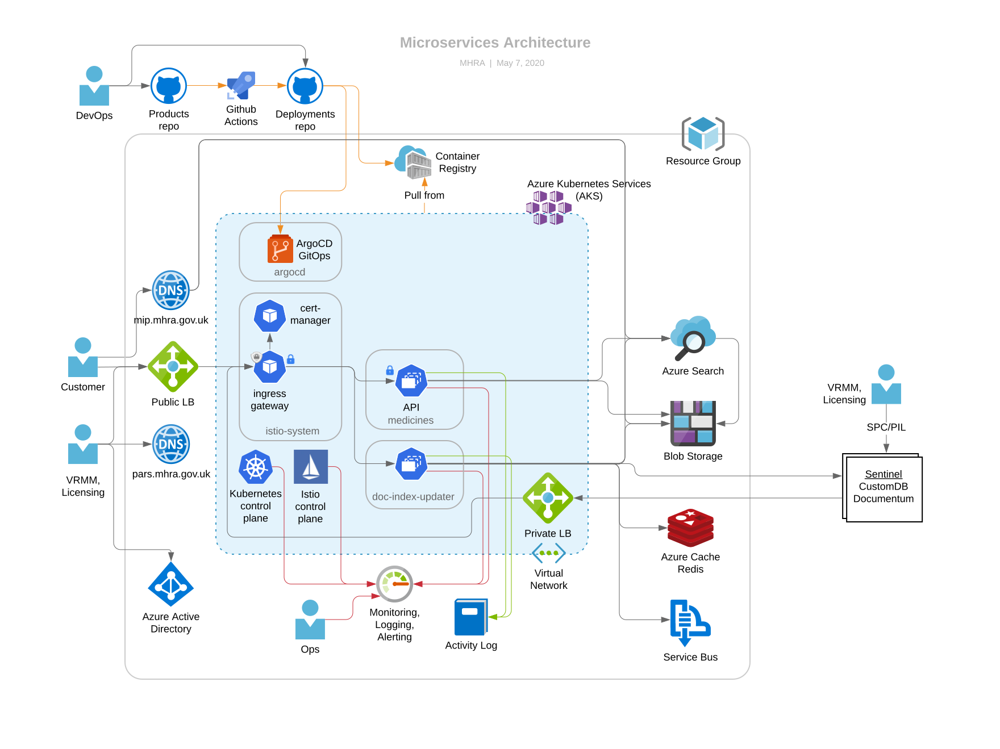

# Project architecture

## The cluster

The diagram above shows how we use Azure’s Kubernetes Service (AKS) to host an API pod for the medicines microservice and a document index updater API pod, which Sentinel’s batch export process calls to update documents for the portal. Although each pod is only shown once, there may be multiple instances of each, for reliability (across zones) and scalability (new instances can be created and destroyed automatically and in just a few seconds).

The shaded blue area is a virtual network consisting of 2 subnets, one for the Kubernetes (K8s) cluster and one for an internal loadbalancer, which is accessible from Sentinel. The cluster hosts an Istio ingress gateway. This is the entrypoint for all incoming requests from the Internet. It terminates SSL using certificates automatically renewed (from [Let’s Encrypt](https://letsencrypt.org/)) by the certificate manager pod. The gateway allows us to do host- and path-based routing to services within the cluster, and we can apply Istio policies, e.g. rate limiting, here.

## Storage

Documents are stored in Azure Blob Storage, named after a digest of their contents. This is called content-based addressing and means that two identical documents resolve to the same name giving us deduplication for free. An updated document resolves to a new name, giving us version history for free. We can keep historical documents for ever as storage is very cheap and effectively infinite.

Metadata for the medicines (including lists of associated documents) is attached to each file. Azure Search indexes the documents (pdf and Blob Storage are both supported). Azure search also has AI plugins for features such as phrase detection. This has the potential to give us a rich, relevant search experience similar to that provided by commercially available search engines such as Google or Bing).

## Medicines API

The API pod contains a lightweight custom HTTP server, written in Rust. It is stateless so it can scale out easily. It allows SPC, PIL and PAR to be searched via a self-documented, read-only, [GraphQL-based API](https://medicines.api.mhra.gov.uk/graphiql) that conforms to the [Open API 3.0 specification](https://github.com/OAI/OpenAPI-Specification/blob/master/versions/3.0.2.md).

## SPC/PIL/PAR document management

The `doc-index-updater` pod is an API for the Sentinel Batch export process for SPCs and PILs, and for the PARs portal for PARs. It is written in Rust and provides an API that validates and processes documents before storing data and PDFs in Azure Blob Storage and Azure Search.

The PARs portal allows medical writers to make changes to the PARS on the site. It is a simple, static site, hosted in Azure Blob Storage (as with the current Products and Learning sites). The site has a form to enter information about the PAR (title, associated PLs, active substances, and so on), and an upload field to upload the PAR in PDF form.

Authentication and authorization is provided by Azure's Active Directory (AD) service. The email addresses of approved medical writers are managed by a group within Azure AD that authorises them to edit PARS.

Login requests are validated by Azure AD and an ID JWT token returned. Once completed, the PAR form is submitted, along with the JWT token, to a PARs endpoint on the Document Index Updater. An authorization policy in Istio ensures that any requests to this endpoint are accompanied by a valid, Azure-signed JWT token that contains the necessary claim to make changes to PARS (granted by membership of the group, defined within AD).

The Document Index Updater then uploads the new document to blob storage and the Azure search index being used by the site, after which, the document is instantly accessible on the products website.

There is also the option within the website to update an existing PAR, which deletes the original PAR at the same time as creating a new, replacement document.

## Update for BMGF

In order for the Products site to host reports associated with the Bill and Melinda Gates Foundation, the following updates will be made.

A new Azure storage container will be created to hold the reports and associated images. Files can be managed either directly through the Azure browser portal or by using the Microsoft desktop tool "Azure Storage Explorer" to upload and delete documents via the Azure API over HTTPS.

The reports will be stored in markdown format, as markdown is straightforward to produce without requiring technical knowledge of HTML, yet allows document structure to be easily parsed and converted into accessible HTML pages.

The website build process will be updated to query the storage container and convert each markdown file into a static HTML page on the site.

An additional "index" page will be created and linked to from the homepage that will list all available reports related to BMGF, making use of the Azure search service to provide search functionality. Clicking on a link from this page will take users to the statically generated report page.
